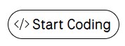
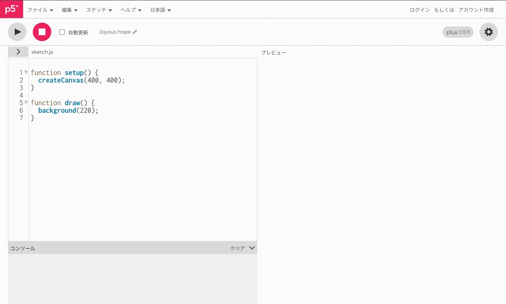
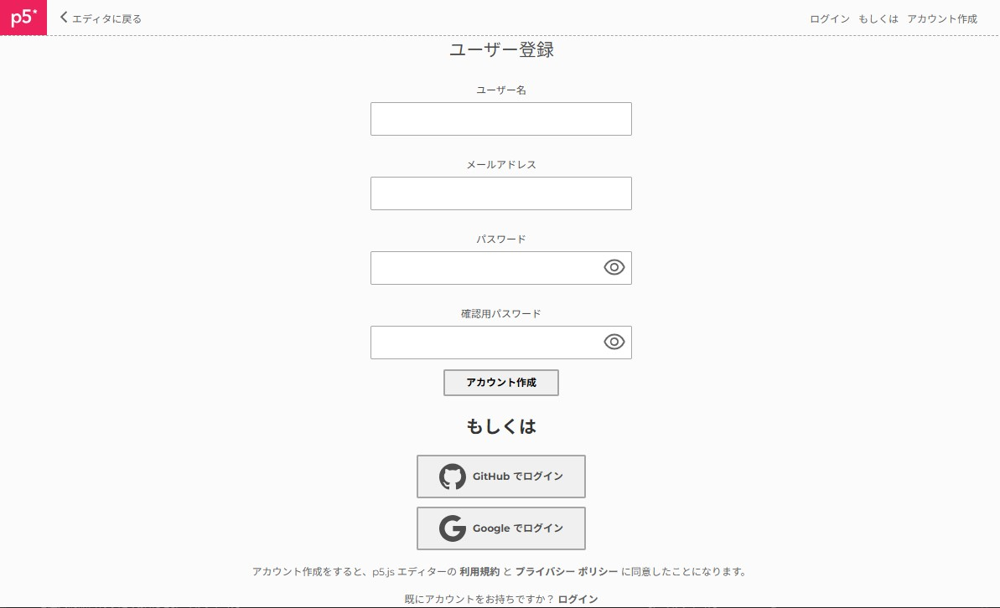
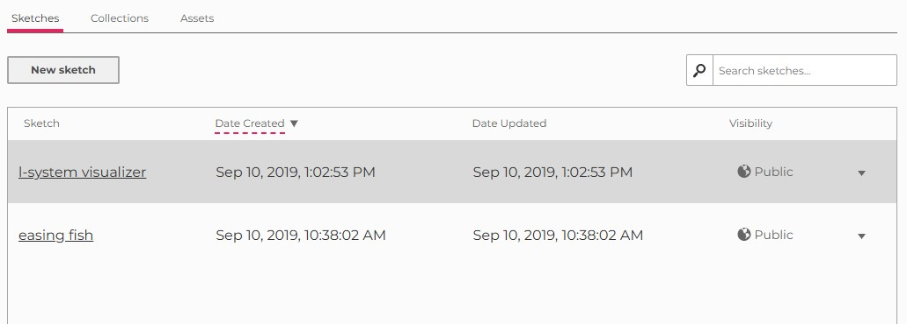

# p5jsへの登録

作ったプログラムを無くさないためにも、まずはp5jsのアカウントを取得しましょう。

### 1. p5jsのサイトを開く
[p5jsの公式ページ](https://p5js.org/)を開きます。

### 2. エディターへ移動する
公式ページを開いたら左下に表示されている。
**Start Coding**ボタンをクリックし、エディターを開きます。

エディター(Editor)が開くと、下のような画面が現れます。

### 3.アカウントを作成する
このまま、コーディングを開始しても良いですが、アカウントが無いとセーブが出来ません。

エディター画面の右上に、**アカウント作成**という文字があるのでコレをクリック。

すると、アカウント作成ウィンドウが表示されるので、 

- ユーザー名
- アドレス
- パスワード

を入力し、アカウントを作成してください。

### 3.スケッチリストをチェックする
アカウントを作成し、ログイン出来たら。エディター左上の **p5** ボタンをクリックしてみます。

すると、スケッチリスト画面が表示されます。

Processingとp5jsでは、プログラムのコードファイルの事を**スケッチ(sketch)**と呼びます。 
このスケッチリストには、自分が過去に保存したスケッチファイルが一覧となって表示され、 
p5jsでの製作中になんども訪れることになるページなので、覚えておきましょう。