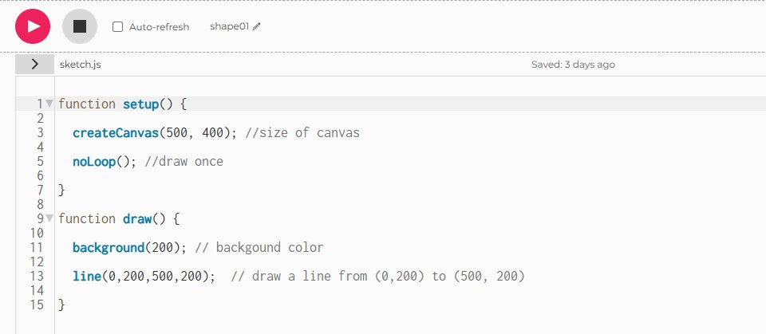
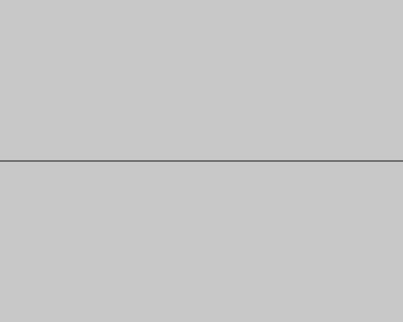

# Shapes : 図形

まずは、下のコードをProcessingにコピー&ペーストして、

```js
function setup() {
  
  createCanvas(500, 400); //size of canvas

  noLoop(); //draw once

}

function draw() {

  background(200); // backgound color

  line(0,200,500,200);  // draw a line from (0,200) to (500, 200)
}
```




画面左上にある実行(RUN)ボタンを押します 

すると書いたプログラムが実行され下のようなウィンドウが表示されます




# まずは最初のコード完成おめでとうございます！

...次のページでは一体何が起こっているのか説明していきます

- **実行(RUN)にはショートカットキーも **

    - Mac：⌘ + Enter

    - Windows：Ctrl + Enter

- 実行ウィンドウはストップボタンで停止できますが、ショートカットは、、、

    - Mac：⌘ + ⇧ + Enter

    - Windows：Ctrl + Shift + Enter