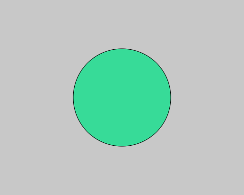
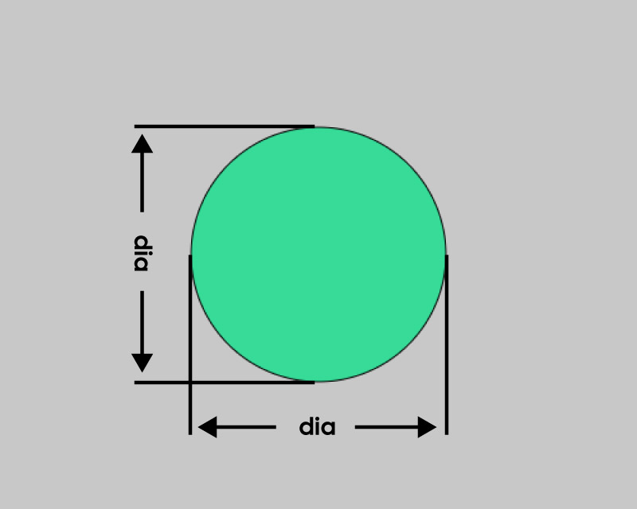
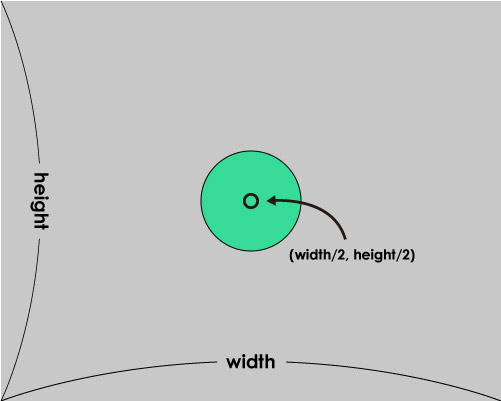

# Variable : 変数

[前のページでやった円を描くプログラム](./shapes/shapes02--circle.md)では円の直径を変えたい時、縦幅と横幅をそれぞれ入力し直さなければなりませんでした。<br>



しかし、次のような書き方をすると一カ所書き直すだけで、円の直径をコントロールできます。

```js
 let dia = 200; // 直径のための変数をつくる

function setup() {
  createCanvas(500, 400);
  
  noLoop();
}

function draw() {
  background(200);

  fill(55,219,152);
  ellipse(250,200,dia,dia);
}
```

プログラムの冒頭で、**dia** という**変数**を作っています。<br>
**変数** とは、変動する数値の入れ物で、**=** を使って好きな値を入れておけます。

今回の例では、変数diaに希望の直径を入れておき、それを後でellipse()に渡すことで横幅と縦幅を同時に変更できるようにしていました。



## 【変数の作り方】
**let 変数名 = 初期値**

変数名：半角英数字の任意の名前、アンダーバー以外の記号は避ける。スペースもNG
初期値：好きな値

## 【用意された定数】
p5jsには、予め用意された定数(自動的に数値が決まっていて変更できない変数)がいくつか存在します。<br>
その中でも良く登場するのが、widthとheightで、これはそれぞれ...

- **width** : キャンバスの横幅
- **height** : キャンバスの縦幅

を持っています。

これを利用すると以下のようなプログラムを組むこともできます。

```js
function setup() {
  createCanvas(500,400);
  
  noLoop();
}

function draw() {
  background(200);

  fill(55,219,152);
  ellipse(width/2,height/2,100,100);
}
```
一見、これまでにやった円のサンプルと変わらないように見えますが、キャンバスのサイズを変更しても常に円が中心位置に描かれるようにできています↓

