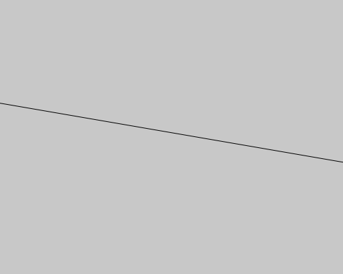

# Random : 乱数

random()は指定した範囲からランダムに数を出力してくれる関数です。

##### 例：
random(80)とすると、0 < = 出力する値　< = 80

random(80,100)とすると、80 < = 出力する値　< = 100

これを使って、ランダムに線を引くプログラムを組んでみます。

```js
function setup() {
  createCanvas(500, 400);
  
  noLoop();
}

function draw() {
  background(200);

  line(0,random(height),width,random(height)); 
}
```

**実行結果↓**



line()の始点と終点の高さが実行するたびにランダムに変化します。