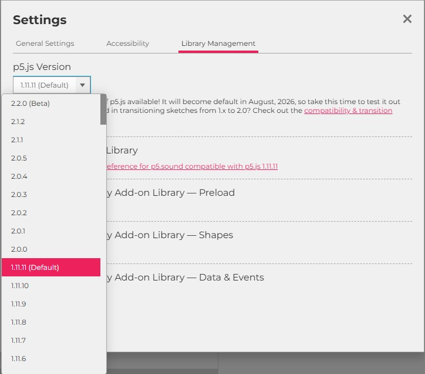
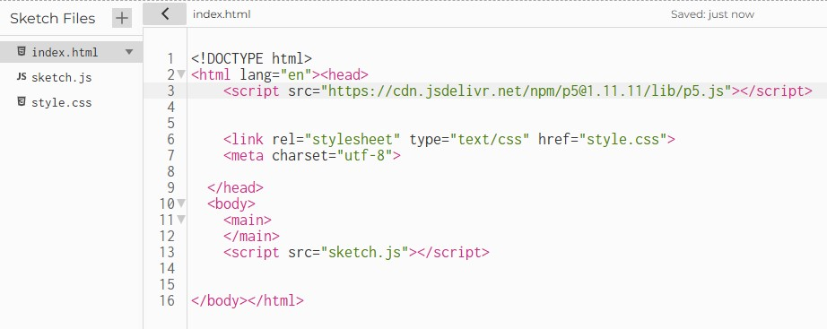
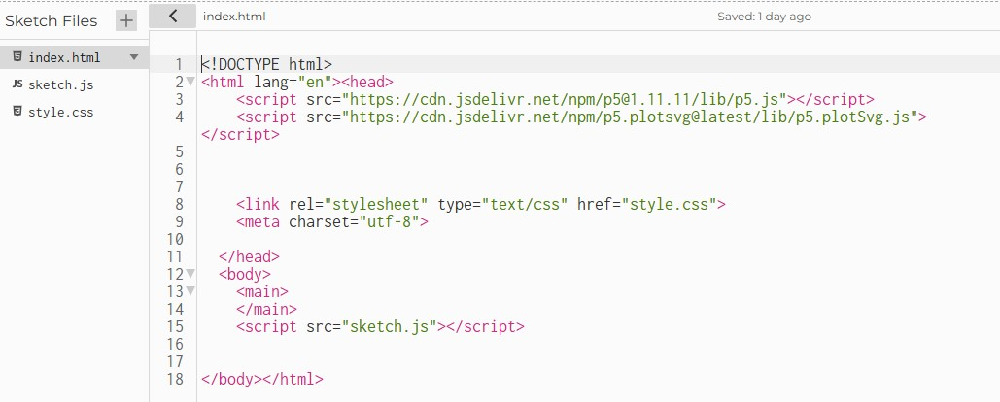
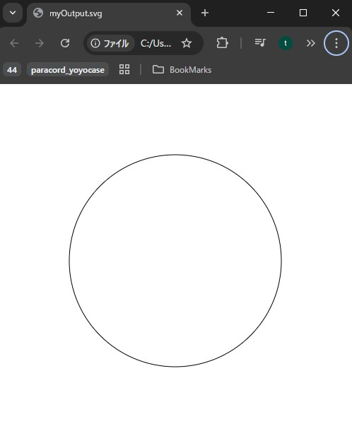

# ExportSVG : SVG書き出し

p5jsで描画したグラフィックを、素材として他のソフトウェアで使用したり、マシンで加工するために SVGというベクターデータとして書き出すこともできます。 ただ書き出すためにいくつか下準備がいるので、順を追って設定を行っていきましょう。

## 【 1. p5jsのバージョンを変える 】

エディター右上にある、 **p5.js ??????** (?は何らかの数字)と表示されている灰色のボタンをクリックします。


すると、使用するp5jsのバージョンを変更できるウィンドウが表示されるので、<br>
ここで、 **1.11.11** を選択します。



最新の2.0.0以上のバージョンではSVG出力がサポートされていないので注意してください。

## 【 2. SVG出力用ライブラリを追加する 】

SVGファイルの書き出し機能は、元の状態のp5jsには搭載されていないのでライブラリ(機能を拡張するためのプログラム)を追加してあげます。

まず、エディターの左側に表示されているファイルリストから、 **index.html** を選択します。



次に、ファイル冒頭にライブラリを追加する1行を書き加えてあげます。

**Before:**
```html
<html lang="en"><head>
    <script src="https://cdn.jsdelivr.net/npm/p5@1.11.11/lib/p5.js"></script>
```

**↓↓↓**

**After:**
```html
<html lang="en"><head>
    <script src="https://cdn.jsdelivr.net/npm/p5@1.11.11/lib/p5.js"></script>
    <script src="https://cdn.jsdelivr.net/npm/p5.plotsvg@latest/lib/p5.plotSvg.js"></script>
```

追加後、index.htmlの内容は下画像のようになるはずです。



これで、p5jsがSVGファイルを書き出せるようになりました。

## 【3. サンプルファイルを走らせてみる】

ここまでできたら、ファイルリストからsketch.jsに戻り↓のサンプルコードを実行してみましょう。<br>

```js
p5.disableFriendlyErrors = true; // 警告メッセージを非表示

function setup() {
  createCanvas(500, 500);
  
  noLoop();
}

function draw() {
  beginRecordSvg(this, "myOutput.svg");
  
  background(220);
  
  ellipse(width/2, height/2, 300, 300);
  
  endRecordSvg(); 
}
```

SVG書き出しを行う為に、いくつか見慣れない行が追加されています。<br>
ここで、スケッチに書いておくべきことをリスト化しておきます↓


### 【SVGを書き出すためのチェック項目】

- p5jsのバージョンを 1.11.11 にしておく
- index.htmlにライブラリを追加しておく
- プログラム冒頭に、 **p5.disableFriendlyErrors = true;** と書く
- setup()に **noLoop()** と書く
- draw()の最初に、 **beginRecordSvg(this, "ファイル名");** と書く
    - ファイル名は、”~.svg”にすること。拡張子大事。
- draw()の最後に、 **endRecordSvg();** と書く
- SVGとして保存したいグラフィックは、 **beginRecordSvg()** と **endRecordSvg()** の間で描く


実行するとブラウザからSVGファイルがダウンロードされるので、ブラウザで開いてSVGが正しく保存されているかチェックしてみましょう。

