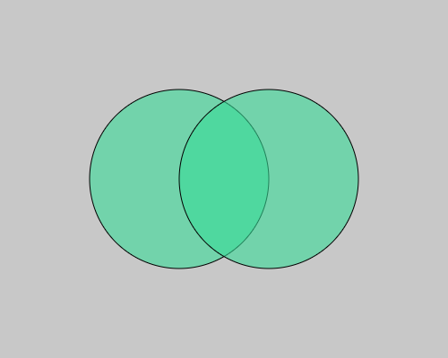
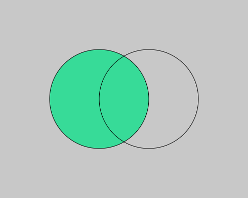

# Color00:塗り

**Fill()**関数を使えば図形の塗りの色を変えることができます。

```js
function setup() {
  createCanvas(500, 400);
  
  noLoop();
}

function draw() {
  background(200);
  
  fill(55,219,152); //change fill color

  ellipse(250,200,200,200); // draw circle  
}
```
実行結果↓


こちらも **background()** 関数と同じくグレースケール,RGB,HEXカラーコードで色を指定することが可能です。(上記の例では、RGB指定)

**[Adobe Color](https://color.adobe.com/ja/create/color-wheel)を使うとより感覚的に色を選べます。**

### 透明度
**fill()** 関数をRGBで色指定して使う場合、通常ではRed,Green,Blueの３つの引数を()内に書き込みますが、更に４つ目の引数を書き込むと透明度として扱われます。

**fill(R, G, B, transparent)**

**※transparentの値は0(透明)~255(不透明)**

```js
function setup() {
  createCanvas(500, 400);
  
  noLoop();
}

function draw() {
  background(200);
  
  fill(55,219,152,150); //change fill color

  // draw circles
  ellipse(200,200,200,200);
  ellipse(300,200,200,200);
}
```
実行結果↓<br>


### 塗り無し
noFill()関数を使うと以降の図形は塗り無しで描画されます。

```js
function setup() {
  createCanvas(500, 400);
  
  noLoop();
}

function draw() {
  background(200);

  fill(55,219,152); //change fill color
  ellipse(200,200,200,200); // draw circle

  noFill(); //fill off
  ellipse(300,200,200,200); // draw circle
}
```
実行結果↓<br>

