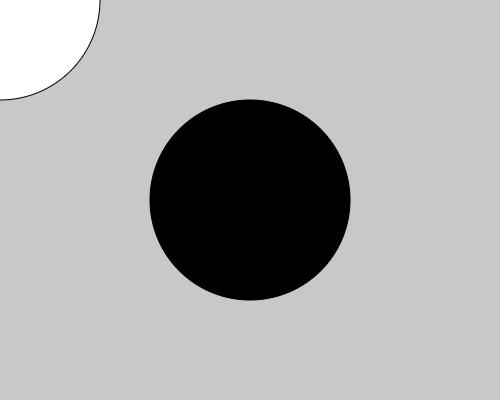
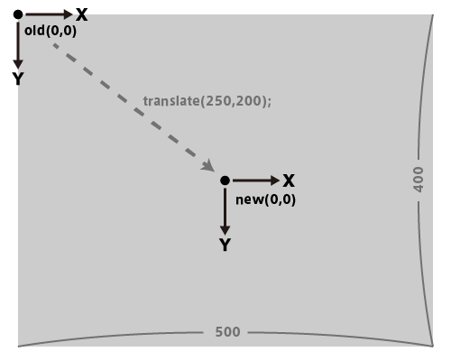
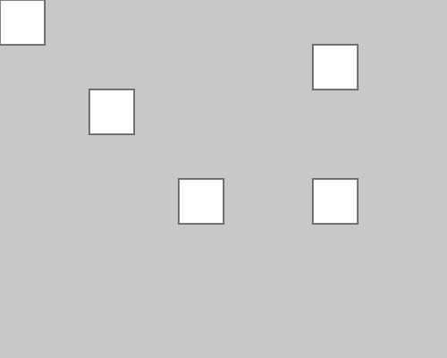
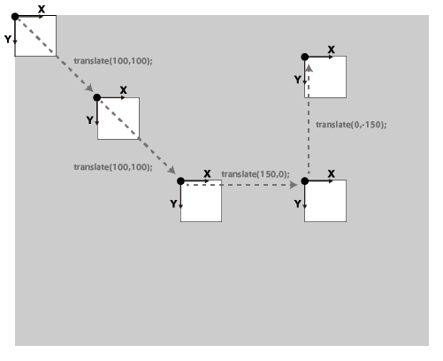

# Origin00 : 原点をずらす(translate)

**translate()** 関数は、原点の位置を移動させる機能を持つ。<br>
**translate(X方向の移動距離, Y方向の移動距離);**<br>
※座標を指定するのではなく、移動距離を指定しているの注意！

まずは、下のプログラムを実行してみましょう

```js
function setup() {
  createCanvas(500, 400);
  noLoop();
}

function draw() {
  background(200);
  
  //元の原点中心に白い円を描画
  fill(255);
  ellipse(0, 0, 200, 200);

  translate(250, 200); //原点をキャンバス中心に移動
  //ここは、　translate(width/2, height/2); とも書けるね

  //移動先の原点で黒い円を描画
  fill(0);
  ellipse(0, 0, 200, 200);
}

```

**実行結果 ↓**



どちらの円も指定座標は、**(0,0)** つまり原点中心。

なので、白い円は左上角（元々の原点）を中心に描かれているため画面外にはみ出してしまう。

しかし、黒い円は白い円と全く同じ位置指定にもかかわらず、キャンバスの真ん中に描かれている。


これは、途中に使われている **translate()** 関数が原点を下の図のように移動した為に起こっている。




## 【座標指定ではなく、移動距離】

次に、別のサンプルを見てみよう

```js
function setup() {
  createCanvas(500, 400);
  noLoop();
}

function draw() {
  background(200);
  
  rect(0,0,50,50);

  translate(100,100);
  rect(0,0,50,50);

  translate(100,100);
  rect(0,0,50,50);

  translate(150,0);
  rect(0,0,50,50);
  
  translate(0,-150);
  rect(0,0,50,50);
}
```

**実行結果 ↓**



translate()の中身は座標指定ではなく、原点をX方向そしてY方向にどれだけずらすか（移動量）であることに注意しよう。


