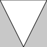
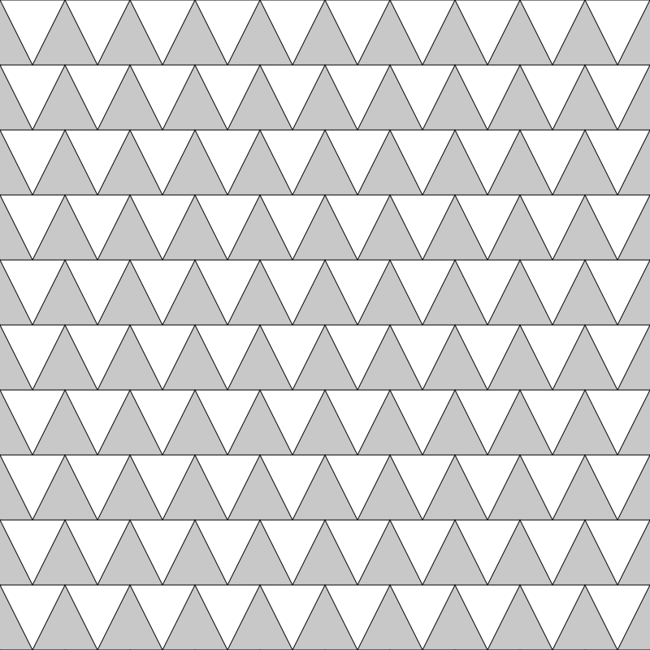

# Origin01 : pushとpop (原点位置の保存と読み出し)

例えば、下のような図形をタテヨコにグリッドに並べる。




これは、vertex()を用いて、次のようなコードで描かれている。


```js
function setup() {
  createCanvas(80, 80);
}

function draw() {
  background(200);
  
  //逆三角形描画
  beginShape();
  vertex(0, 0);
  vertex(80, 0);
  vertex(40, 80);
  endShape(CLOSE);
}
```

これを、[前にやった方法](../variable/variables01--for.md)でグリッドに並べようとすると、

**vertex()** のX,Y座標の中身を全部計算式に置き換えないといけないので、面倒くさい。

そこで **translate()** で、原点位置をずらして、スタンプを押す位置を変えていくが如くグリッド上に並べてみたいと思う。

ただ、 **translate()** は前のページでも言った通り、原点が今いる所からの移動量を受け取るので、

座標指定を繰り返していくとドンドンずれていってしまう。

なので今回は、

---

translate()で三角形を書きたい所に原点移動<br>
↓<br>
vertex()で三角形描画<br>
↓<br>
原点をキャンバス左上角(元々の原点位置)に移動して<br>
↓<br>
translate()で次の三角形を書きたい所に原点移動<br>
↓<br>
以下、同様に繰り返し

---

というふうにグリッドを描いていこうと思う。

そこで役に立つのが **push()** と **pop()** という関数だ。<br>
簡単に説明すると、

**push() : 今の原点位置を記録　セーブみたいなもん**

**pop() : push()で記録された位置に原点を戻す　ロードみたいなもん**

という感じ。<br>
これを使って、グリッドに並べるプログラムを書くとこうなる。

```js
function setup() {
  createCanvas(800, 800);
}

function draw() {
  background(200);
  
  for(let j =0; j<=10; j++){
    for(let i =0; i<=10; i++){
      push(); // キャンバスのオリジナル原点を記録
      translate(80*i,80*j); // iとjの数値によって原点をX方向とY方向にずらす
      
      // 逆三角形描画
      beginShape();
      vertex(0, 0);
      vertex(80, 0);
      vertex(40, 80);
      endShape(CLOSE);
      
      pop(); // キャンバスのオリジナル原点に戻る
    }
  }
}
```

これの結果画面はこうなる↓



便利な機能だが、popMatrix()で記録された原点位置を１回読みだすと、記録が消えてしまうので注意。<br>
ロードしたら消えてしまうセーブデータだと思ってくれるといいだろう。<br>