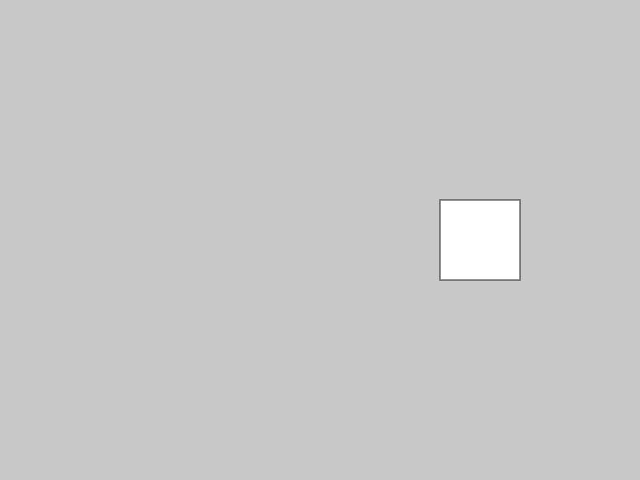
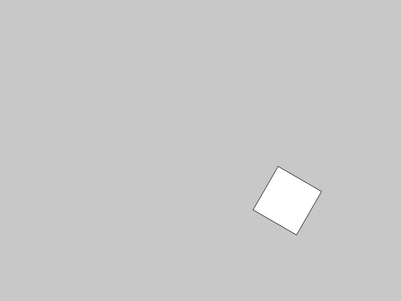
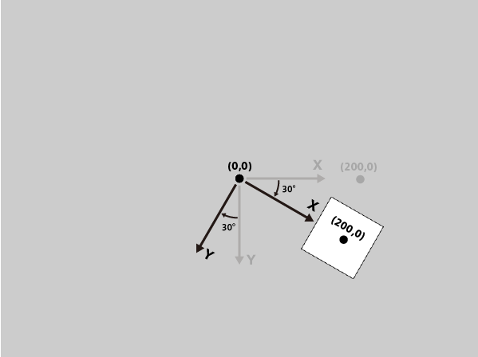
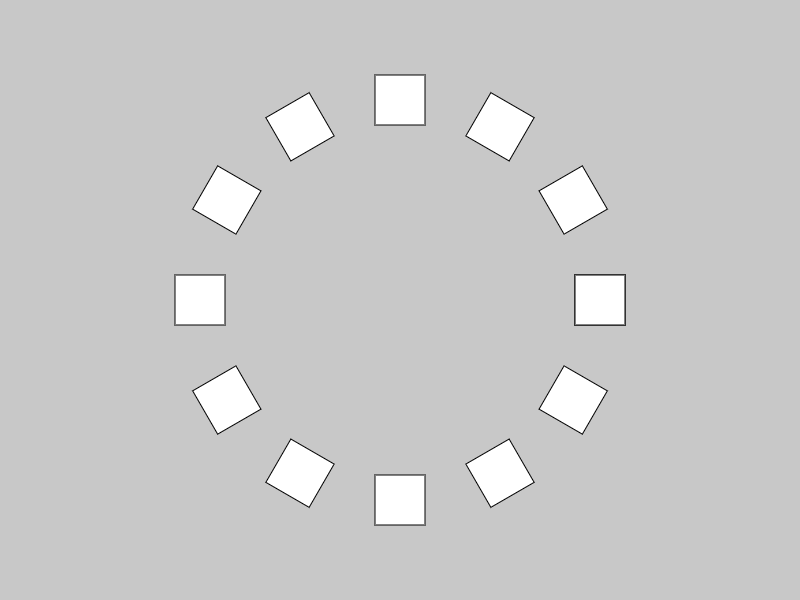

# Origin02 : 原点を回転(rotate)

**rotate()** 関数を使えば、原点を中心にX軸とY軸の方向を変えることが出来る。

**rotate(回転させたい角度);　　※角度はラジアン指定**

例えば、以下のようなプログラムを走らせる。


```js
function setup(){
  createCanvas(800,600);
  
  rectMode(CENTER);
  noLoop();
}

function draw(){
  background(200);
  
  translate(width/2, height/2); //原点をキャンバス中央に移動

  rect(200,0,100,100); //原点からX方向に200離れた位置を中心に四角形を描く
}
```

**実行結果↓**



最初のtranslate()で、原点がキャンバスの中心に移動しているため、

(200,0)を中心に描いた四角形は、図の位置に描画される。


次に、四角形を描く前に **rotate()** 関数をいれてみる。

```js
function setup(){
  createCanvas(800,600);
  
  rectMode(CENTER);
  noLoop();
}

function draw(){
  background(200);
  
  translate(width/2, height/2); //原点をキャンバス中央に移動

  rotate(PI/6); // X軸＆Y軸をPI/6 = 30°傾ける

  rect(200,0,100,100); //原点からX方向に200離れた位置を中心に四角形を描く
}
```

すると結果はこう変化する。



rotate()により、原点を中心に時計回りにX軸とY軸が30°回転したため、

数値は同じでも、描画される方向がずれた。




## 【Rotateで環状配置】

またrotate()による回転も、pushMatrix()とpopMatrix()で元に戻すことが出来るため。

オブジェクトを以下のように環状に配置することも可能。


```js
let theta = 0;
let item_number = 12;

function setup(){
  createCanvas(800,600);
  
  rectMode(CENTER);
  noLoop();
}

function draw(){
  background(200);
  
  for(let i=0; i<= item_number; i++){
  
    push();
    
    translate(width/2, height/2); //原点をキャンバス中央に移動

    rotate(TWO_PI/item_number * i); // X軸＆Y軸をPI/6 = 30°傾ける

    rect(200,0,50,50); //原点からX方向に200離れた位置を中心に四角形を描く
    
    pop();
  }
}
```

**結果画像↓**

