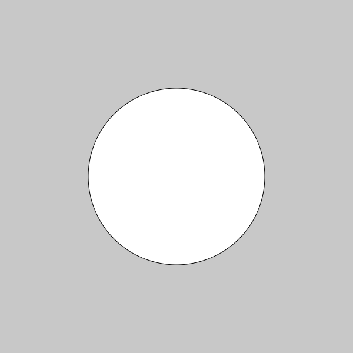
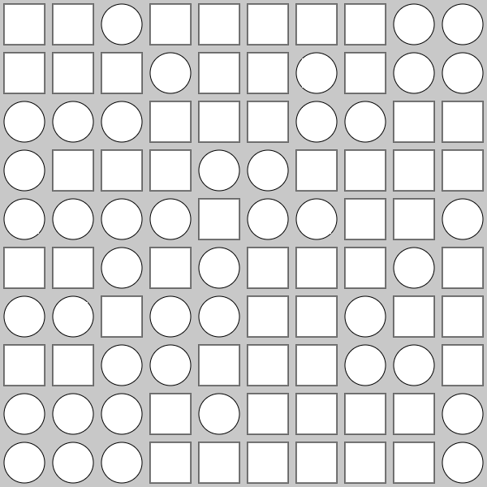

# Random00 : サイコロ

**(int)random( 出て欲しい目の数 ) % 出て欲しい目数**

と書くとランダム関数をサイコロとして使える。
("%"は割り算ではなくて、余りを返す。)

### 例：通常の６面サイコロとして使う場合。
```java
int answer = (int)random(6) % 6;
```

※この場合変数answerに入るのは、0～5までの整数のどれかになる。

## 【サンプル01】
ランダムで丸か四角を中央に描く。(実行するたびに結果が違う)

```js
let dice = 0;

function setup() {
  createCanvas(600, 600);
  noLoop();
  
  rectMode(CENTER);
  ellipseMode(CENTER);
}

function draw() {
  background(200);

  dice = int(random(2)%2);

  if(dice == 0){
    rect(width/2, height/2, 300, 300);
  }else if(dice == 1){
    ellipse(width/2, height/2, 300, 300);
  } 
}
```

**実行結果↓**




## 【サンプル02】
サンプル01と[for文でやったグリッドに並べるプログラム](../variable/variables01--for.md)の応用で、縦横に10x10でランダムに丸か四角を並べる

```js
let dice = 0;
let x = 0;
let y = 0;


function setup() {
  createCanvas(600, 600);
  noLoop();
  
  rectMode(CENTER);
  ellipseMode(CENTER);
}

function draw() {
  background(200);

  for(let j=0; j < 10; j++){
    for(let i=0; i < 10; i++){
  
      x = (width/10)*i + width/10/2;
      y = (height/10)*j + height/10/2;
      
      dice = int(random(2)%2);

      if(dice == 0){
        rect(x, y, 50, 50);
      }else if(dice == 1){
        ellipse(x, y, 50, 50);
      }
      
    }
  }
}

```

**実行結果↓**



#### あとはサイコロの出目で色を変えたり、大きさ変えたり、色々使える...