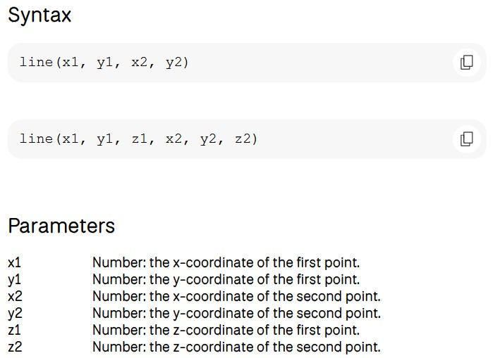

# Shape01:線を引く

続けて、コードを見ていきましょう

```js
function setup() {
  
  createCanvas(500, 400); //size of canvas

  noLoop(); //draw once

}

function draw() {

  background(200); // backgound color

  line(0,200,500,200);  // draw a line from (0,200) to (500, 200)

}
```

先ほどと同じく、分からない関数があったら[P5jsのリファレンスページ](https://p5js.org/reference/)を見て調べます。  

**noLoop() ← draw()グループに書かれた命令を繰り返さない**

**background()　←　背景色を変える** ※colorの章で詳しく解説しています

[line()のページ](https://p5js.org/reference/p5/line/)を見てみると以下のように書かれております



説明によるとline()はその名の通り、線を引くため関数で()内に２点のxy座標を入れるとその点同士を結ぶ直線を引いてくれます。  
(今は2Dグラフィックのモードなので、Z座標は無視します。)

また、p5jsのウィンドウでは...  
**左から右：X軸方向  
上から下：Y軸方向**  
となっています。なので、

```js
line(0,200,500,200);
```

と書くと以下のようになります。


ウィンドウの左上が原点(0,0)であり、(0,200)から(0,500)まで直線が引かれております。

Y軸方向のウィンドウサイズはsize()により400で作られているので、

ウィンドウのちょうど中間に線が引かれていますね。

## 【プログラムの世界での加減乗除】

プログラムの世界では、加減乗除の記号が一般的な表記と異なります。

| 演算の種類 | 一般的な表記 | プログラム上の表記 |
| ---- | ---- | ---- |
| 加算 | + | + |
| 減算 | - | - |
| 乗算 | × | * |
| 除算 | ÷ | / |
| 剰余演算 | % | % |

※[剰余演算](https://ja.wikipedia.org/wiki/%E5%89%B0%E4%BD%99%E6%BC%94%E7%AE%97#%E5%89%B0%E4%BD%99%E6%BC%94%E7%AE%97%E3%81%AE%E8%A1%A8%E8%A8%98)とは、ある数を別の数で割った時の余りを求める計算のこと。