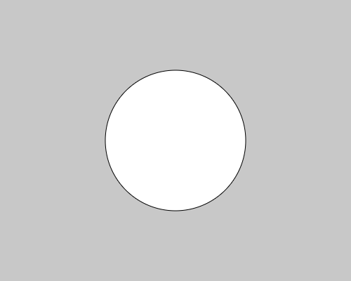
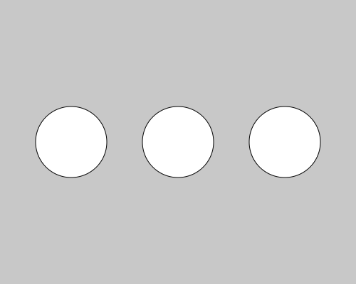
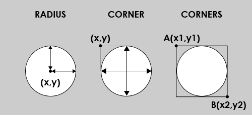

# Shape02:円を描く

楕円を描くための関数 **ellipse()** を使って
シンプルな円を描いてみましょう。

```js
function setup() {
  createCanvas(500, 400);
  
  noLoop();
}

function draw() {
  background(200);
  
  ellipse(250,200,200,200);  // draw a circle at (250,200), radius= 100
}
```
結果↓



関数ellipse()は通常以下のように使います

**ellipse(中心のX座標, 中心のY座標,　楕円の幅,　楕円の高さ);**

...このコマンドについてもう１つ例を見てみましょう

```js
function setup() {
  createCanvas(500, 400);
  
  noLoop();
}

function draw() {
  background(200);
  
  ellipseMode(RADIUS);
  // draw a circle, center is (250,200), half of width=50, halof of height=50
  ellipse(100,200,50,50);

  ellipseMode(CORNER);
  // draw a circle, top-left is (200,150), width=100, height=100
  ellipse(200,150,100,100);

  ellipseMode(CORNERS);
  // draw a circle, one corner is (350,150), another-corner is (450,250)
  ellipse(350,150,450,250);

  //if you wanna go back to default, use ellipseMode(CENTER)
}
```

結果↓



一見同じ様な円が３つ並んでいるように見えますが、実はひとつづつ異なるellipse()の使い方で描画されています。

ellipseMode()と言う関数を使うと、異なる引数で円が描けるようになるのです。

左から順に説明していくと...

**ellipseMode(RADIUS);** という行以降では<br>
**ellipse(中心のX座標, 中心のY座標,　楕円の半径(X方向),　楕円の半径(Y方向));**<br>
※最初のモードとほぼ同じだが直径ではなく半径で高さと幅を指定します

**ellipseMode(CORNER);** という行以降では<br>
**ellipse(左端のX座標, 上端のY座標,　楕円の幅,　楕円の高さ);**<br>
※与えられた左端と上端を基準に与えられた幅と高さどおりの楕円を描きます

**ellipseMode(CORNERS);** という行以降では<br>
**ellipse(点AのX座標, 点AのY座標, 点BのX座標, 点BのY座標);**<br>
※点Aと点Bが対角関係にある直角長方形に内接する楕円形を描きます

###### デフォルトに戻したい場合は、ellipseMode(CENTER);

