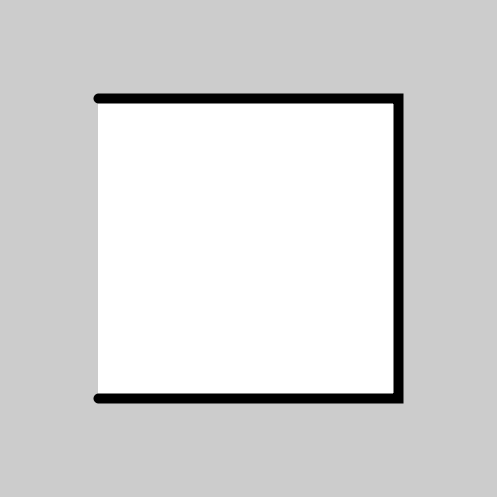
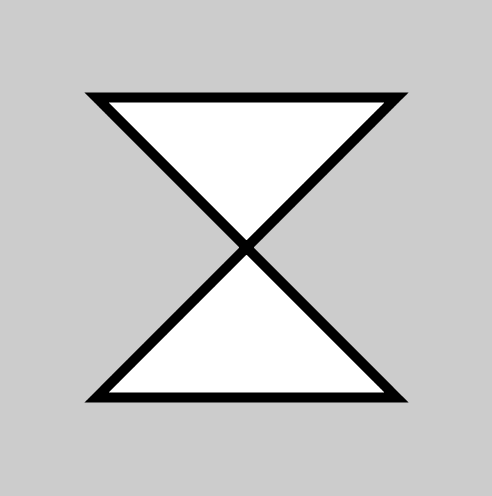

# Shape04:複雑な図形
イラレのペンツールのように、点(vertex)同士を結んだ図形を描くための関数 **vertex()** を使って
より複雑な図形を描いてみましょう。

```js
function setup() {
  createCanvas(500, 500);
  
  noLoop();
}

function draw() {
  background(200);
  
  strokeWeight(10); // change width of line
  
  beginShape();
  vertex(100,100);
  vertex(400,100);
  vertex(400,400);
  vertex(100,400);
  endShape();
}
```

結果↓



**beginShape();** から **endShape();** の間に入れた **vertex();** の座標を繋いで図形を作ってくれます。これなら、線の色だけでなく塗の色もfill();で指定できます。

また、endShape(CLOSE);と書くと始点と終点を直線で繋いでくれます。

```js
function setup() {
  createCanvas(500, 500);
  
  noLoop();
}

function draw() {
  background(200);
  
  strokeWeight(10); // change width of line
  
  beginShape();
  vertex(100,100);
  vertex(400,100);
  vertex(400,400);
  vertex(100,400);
  endShape(CLOSE);
}
```

結果↓


おなじ座標の組み合わせでも順番を変えると、図形も変化します。
ここでは、３番目と４番目のvertex();を入れ替えてみました。

```js
function setup() {
  createCanvas(500, 500);
  
  noLoop();
}

function draw() {
  background(200);
  
  strokeWeight(10); // change width of line
  
  beginShape();
  vertex(100,100);
  vertex(400,100);
  vertex(100,400);
  vertex(400,400);
  endShape(CLOSE); //close shape with line.  
}
```

結果↓

