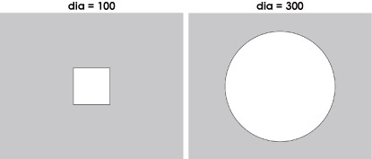

# Varible00:if文 (条件分岐)

if文はある条件をみたすときだけ命令を行うような時に役立ちます。

```js
if(条件){
    •••ここは条件を満たすときだけ実行される•••
}
```
また、条件から外れた場合に別の命令を実行して欲しい時は、こう書きます。
```js
if(条件){
    •••ここは条件を満たすときだけ実行される•••
}else{
    •••ここは条件を満たさない時にときだけ実行される•••
}
```

これを使って、

- 直径(変数dia)が200以下だったら四角形を描く
- それ以外(変数diaが200より大きい)だったら四角形を描く

というプログラムを組むとこうなります↓

```js
 let dia = 300; //ここの数値を変えれば、下のプログラムを書き直す必要がない

function setup() {
  createCanvas(500, 400);
  
  rectMode(CENTER);
  ellipseMode(CENTER);
  
  noLoop();
}

function draw() {
  background(200);

  if(dia <= 200){
    // もしdiaが200以下だったら
    rect(width/2,height/2,dia,dia);
  }else{
    // それ以外の場合は
    ellipse(width/2,height/2,dia,dia); 
  }
  
}
```

**実行結果 ↓**



## 【条件の種類】

条件の種類には、いくつかの書き方がありこれらを組み合わせるとより複雑なif文を組むことが出来ます。

| 条件文 | 意味 |
| ---- | ---- |
| A == B | AとBは等しい |
| A != B | AとBは異なる |
| A > B | A は Bを超過している (A==Bを含まない) |
| A >= B | A は B以上である (A==Bを含む) |
| A < B | A は B未満である (A==Bを含まない) |
| A <= B | A は B以下である (A==Bを含む) |

※プログラムの世界では、

- **A = B** は、『変数Aに値Bを代入する』
- **A == B** は、『AとBは等しい』

という風に **意味が異なる** 点に注意してください。

## 【if文の追加】

条件分岐をさらに追加したい場合は、 **else if** 文を使います。

```js
if(条件1){
    •••ここは条件1を満たすときだけ実行される•••
}else if(条件2){
    •••ここは条件1が満たされず、条件2を満たすときだけ実行される•••
}else{
    •••ここは上記条件のいずれも満たしていない時に実行される•••
}
```

基本的に **if** は１つに対して、 **else** は１つ(つけなくてもOK)ですが、<br> **else if**は、いくつでも追加することが可能です。

```js
if(条件1){
    •••ここは条件1を満たすときだけ実行される•••
}else if(条件2){
    •••ここは条件1が満たされず、条件2を満たすときだけ実行される•••
}else if(条件3){
    •••ここは条件1と条件2が満たされず、条件3を満たすときだけ実行される•••
}else if(条件4){
    •••ここは条件1と条件2と条件3が満たされず、条件4を満たすときだけ実行される•••
}else{
    •••ここは上記条件のいずれも満たしていない時に実行される•••
}
```


## 【複数条件の合体】

以下の２つの記号を使って条件をくっつけることで、より複雑な条件を作ることもできます。

- **||** ←または
- **&&** ←かつ

**例：**<br>

```js
if( 条件1 || 条件2 ){
    •••ここは条件1または条件2を満たすときだけ実行される•••
}

if( 条件1 && 条件2 ){
    •••ここは条件1かつ条件2を満たすときだけ実行される•••
}

if( 条件1 && 条件2 && 条件3){
    •••ここは条件1かつ条件2かつ条件3を満たすときだけ実行される•••
}

```