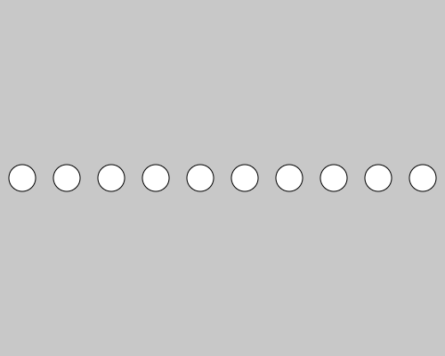
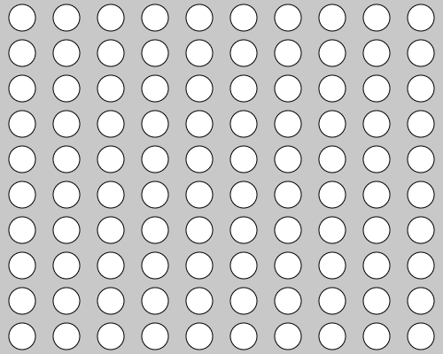

# Varible02 : for文 (繰り返し)

for文を使えば任意の命令を好きな回数だけ繰り返すことができます

```js
  for(変数; 条件; 処理){
    •••条件から外れるまで、ここの命令が繰り返されます•••
  }
```

- **変数** : for文の中でのみ使える変数を作って初期値も入れておきます。
- **条件** : ここにいれた条件文が満たされる限り、for文は中身の命令を繰り返します。
- **処理** : for文の中身の命令を最後まで実行し終え、次の繰り返しを始める前に、毎回行う計算式を入れておきます


これを使って、円を横に10回並べるプログラムを書くと以下のようになります。

```js
let x = 0;

function setup() {
  createCanvas(500, 400);
  
  noLoop();
}

function draw() {
  background(200);

  for(let i=0; i<10; i++){
    x = i*width/10+width/10/2; // 円の位置を計算する
    ellipse(x, 200, 30, 30);
  }

}
```

**実行結果 ↓**



## 【インクリメントとデクリメント】
変数の中身を１ずつ増やしたり(インクリメント)、減らしたりする(デクリメント)ことが、プログラムを書いてると多発する。<br>
プログラマはめんどくさがりな生き物なので、省略した書き方が存在する。

|用語|演算子|例|意味|
|---|---|---|---|
|インクリメント|++|count++;|count = count + 1;|
|デクリメント|--|count--;|count = count - 1;|


## 【多重ループ】

さらに、この上記プログラムを改造して、縦横に10 x 10のグリッド状に円を並べようと思います。<br>
10個横に並べることはすでにできているので、この部分をさらにfor文で囲み、10回繰り返すと、<br>
↓のようになります。

```js
let x = 0;
let y = 0;

function setup() {
  createCanvas(500, 400);

  noLoop();
}

function draw() {
  background(200);

  for (let j = 0; j <= 10; j++) {
    //縦に10回繰り返す
    for (let i = 0; i <= 10; i++) {
      //横に10回繰り返す
      x = (i*width)/10 + width/10/2;
      y = (j*height)/10 + height/10/2;
      ellipse(x, y, 30, 30);
    }
  }
}
```

**実行結果↓**



このように、ループを入れ子構造にするとより複雑な図形を描くことが出来ます。